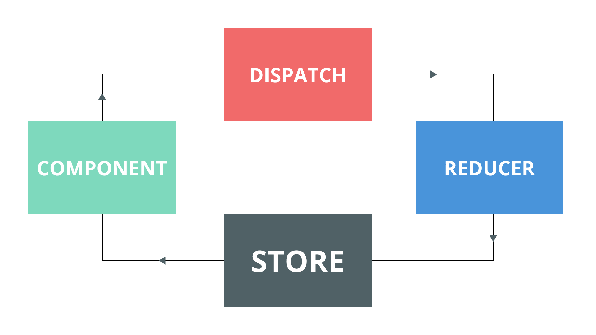

## Getting started

The idea behind using redux pattern is to create a predictable one way data flow across the application. In redux pattern, we do not mutate the state directly but instead we dispatch actions with the payload and type. Actions with the payload go through a reducer function to determine the next state of application. Let's just get started by creating a new angular project using angular cli and leave out routing for this project.

```css
$ ng new angular-redux
```



## State model

Create a file `state.ts` for interface to model the global state of application and a initial state variable.

```ts
state.ts

export interface State {
  items: string[];
}

export const initial: State = {
  items: [],
} 
```

## Actions

Actions are just classes with a required type and optional payload. Payload contains the data you want to append or to be replaced in the state.

```ts
action.ts

export class Action {
  constructor(public type: string, public payload?: any) {}
}
```

## Reducer function

Create a new file `reducer.ts` in the same directory. The reducer function generally takes current application state and action which uses the switch statement to determine and mutate the state according to type of action and then returns the new state. You can optionally implement other actions for full CRUD operations.

```ts
reducer.ts

import { Action } from './action';
import { State } from './state';

export function reducer(state: State, action: Action): State {
  let next: State;

  switch (action.type) {
    case 'ADD_ITEM':
      next = { items: [...state.items, action.payload] };
      break;
    default:
      next = { ...state };
  }

  return next;
}
```

## Store service

This is the injectable service that we will use in components to dispatch actions with payload. Under the hood, you can see this service is using RXJS.

```ts
store.ts

import { Injectable } from "@angular/core";
import { BehaviorSubject } from "rxjs";
import { Subject } from "rxjs";
import { Action } from './action';
import { reducer } from './reducer';
import { initial, State } from "./state";

@Injectable({ providedIn: 'root' })
export class Store {

}
```

We gonna create `actions` Subject and `stateSubject` BehaviorSubject with the initial state we created earlier. Also a public field which is just observable of stateSubject.

```ts
store.ts

import { Injectable } from "@angular/core";
import { BehaviorSubject } from "rxjs";
import { Subject } from "rxjs";
import { Action } from './action';
import { reducer } from './reducer';
import { initial, State } from "./state";

@Injectable({ providedIn: 'root' })
export class Store {

  private actions = new Subject<Action>();
  private stateSubject = new BehaviorSubject<State>(initial);

  state$ = this.stateSubject.asObservable();

  constructor() {}
}
```

Now, subscribe to actions Subject in the constructor that will fire a function every time a component dispatches a action by `dispatch()` function. the subscribe function will get current state from stateSubject and then send through the reducer function we created earlier. Since the reducer returns the new state, we gonna send new state to `stateSubject`. Every component that subscribes to the `state$` will receive new state automatically.

```ts
store.ts

import { Injectable } from "@angular/core";
import { BehaviorSubject } from "rxjs";
import { Subject } from "rxjs";
import { Action } from './action';
import { reducer } from './reducer';
import { initial, State } from "./state";

@Injectable({ providedIn: 'root' })
export class Store {

  private actions = new Subject<Action>();
  private stateSubject = new BehaviorSubject<State>(initial);

  state$ = this.stateSubject.asObservable();

  constructor() {
    this.actions.subscribe(action => {
      const state = this.stateSubject.value;
      const newState = reducer(state, action);
      this.stateSubject.next(newState);
    });
  }

  dispatch(action: Action) {
    this.actions.next(action);
  }

}
```

## Using store

At this point, the store service can be injected into any component. To set an example, I will be using in app component. Notice I added a `addItem()` method to dispatch a action with type `'ADD_ITEM'` and payload as `'example item'`.

```ts
app.component.ts

import { Component, OnInit } from '@angular/core';
import { Observable } from 'rxjs';
import { Action } from './store/action';
import { State } from './store/state';
import { Store } from './store/store';

@Component({
  selector: 'app-root',
  templateUrl: './app.component.html',
  styleUrls: ['./app.component.scss']
})
export class AppComponent implements OnInit {

  state$: Observable<State>;

  constructor(private store: Store) {}
  
  ngOnInit() {
    this.state$ = this.store.state$;
  }

  addItem() {
    this.store.dispatch(new Action('ADD_ITEM', 'example item'));
  }

}
```

Using in `app.component.html`

```html
<main>
  <button (click)="addItem()">Add item</button>
  <pre>{{ state$ | async | json }}</pre>
</main>
```