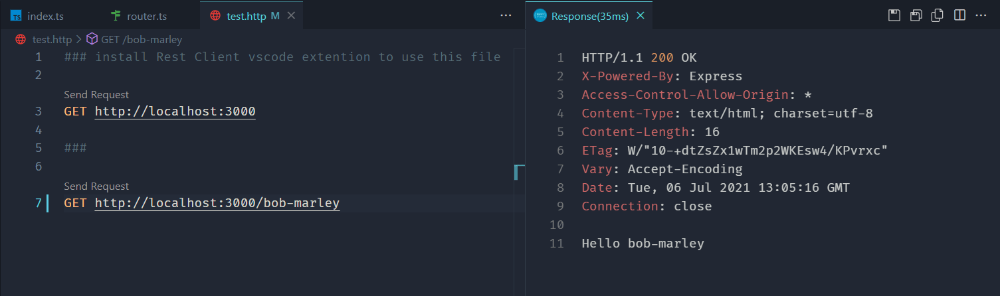

## Getting started

Starting with initializing a new npm project and optionally installing some dependencies for typescript and express and their types.

```css
$ npm init -y
$ npm i express 
$ npm i -D typescript ts-node nodemon
$ npm i -D @types/node @types/express
```

## tsconfig

Initialize a tsconfig file in root directory of the project to inform typescript to how to transform ts code to js. Find and uncomment outDir and rootDir properties in `tsconfig.json` file.

```css
$ tsc --init
```

```json 
'tsconfig.json'

{
  "compilerOptions": {
    "outDir": "./build",
    "rootDir": "./src"
  }
}
```

## Setting up index.ts file

Thanks to typescript we can use ES6 syntax for import/export statements out of the box. Since the express library is tree shakable, we can only import functions/types that we need.

```ts
'index.ts'

import express, { Application, json } from 'express';

const app: Application = express();
const port: number = parseInt(process.env.PORT || '3000');

app.use(json());

app.listen(port, () => { 
  console.log(`Server running on port: ${port}`)
});
```

## Using router
Create new file `router.ts` in the same directory as `index.ts`

```ts
'router.ts'

import { Router, Request, Response } from 'express';

const router: Router = Router();

router.get('', (request: Request, response: Response) => {
  response.send('Hello World!');
});	

router.get('/:name', (request: Request, response: Response) => {
  const name: string = request.params['name'];

  response.send(`Hello ${name}`);
});

export default router;
```

Using router in `index.ts`

```ts
'index.ts'

import router from './router';

app.use(router);
```

## Using logger middleware

Create new file logger.ts in the same directory as index.ts

```ts
'logger.ts'

import { Request, Response, NextFunction } from 'express';

export default function logger(
  request: Request, 
  response: Response, 
  next: NextFunction
) {
  console.log(`${request.method} ${request.url}`);
  next(); // important!
}
```

Using logger in index.ts

```ts
'index.ts'

import logger from './logger';

app.use(logger);
```

## Using cors

If you are building a full-stack project, then you might need to enable cors in your application in production.

```css
$ npm i cors @types/cors
```

```ts
'index.ts'

import cors from 'cors';

app.use(cors);
```

## Using compression (gzip)

Gzipping can drastically improve javascript bundle transfer speed from server to client browser

```css
$ npm i compression @types/compression
```

```ts
'index.ts'

import compression from 'compression';

app.use(compression());
```

## Testing the api

Optionally you can install Rest Client vscode extension to test our api from vscode itself. after installing create a new file test.http in root directory.

```css
$ touch test.http
```

```bash
'test.http'

### install Rest Client vscode extension to use this file 

GET http://localhost:3000

###

GET http://localhost:3000/bob-marley
```



## Scripts

Add these scripts to your `package.json` to run or build your application

```ts
"scripts": {
  "start": "node dist/index.js",
  "start:dev": "nodemon src/index.ts",
  "build": "tsc -p ."
}
```